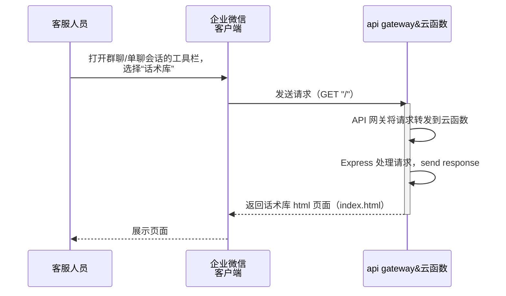
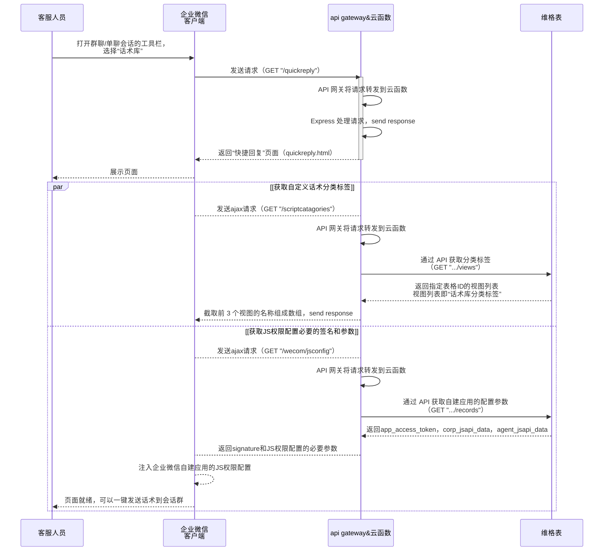

# vika企业微信话术库的工作原理

本工程选用 [腾讯云函数（SCF）](https://cloud.tencent.com/product/scf) 作为执行环境，所有代码通过 [Serverless Framework CLI](https://cloud.tencent.com/document/product/583/44751) 一键部署到云端。

## 工作原理

### 一、访问话术库首页

### 访问话术库“快捷回复”页面

