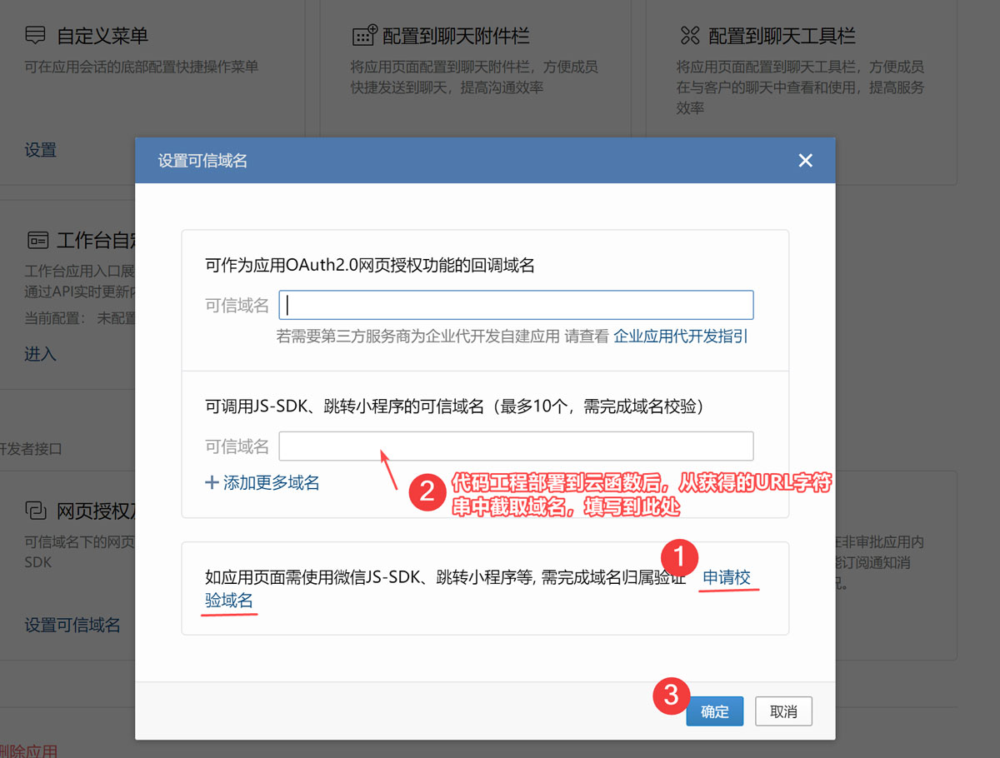

# 创建与配置企业微信自建应用

为了话术库页面可以实现一键发送话术消息（文本/H5卡片等类型）至企业微信会话。开发者需要跟随下方步骤创建与配置企业微信自建应用。

## Step 1：创建应用

下图为企业微信的管理后台，选择“应用管理 > 创建应用”，填写应用LOGO、应用名称，选择可见范围，即可完成自建应用的创建操作。


<br/>

## Step 2：配置应用

要完整体验代码工程的所有功能，需要使用企业微信自建应用的两项能力：
- 配置到聊天工具栏
- 网页授权及JS-SDK


<br/>

### （1）配置到聊天工具栏

要配置到工具栏，则页面需要一个公网可以访问的Url。
代码工程进行云端部署（ ```sls deploy``` ）的时候，腾讯云 api-gateway 会返回一个可直接访问的 URL。


<br/>

在下方截图，点击按钮“配置页面”，新建自定义页面，粘贴上述 URL。
① 话术搜索：对应 Express 路由的“/”
② 快捷回复： 对应 Express 路由的“/quickreply”


<br/>

### （2）网页授权及JS-SDK

因为需要调用 JS-SDK 的接口[ 分享消息到当前会话 ](https://work.weixin.qq.com/api/doc/90000/90136/94349)，所以自建应用需要设置可信域名。

参考下方截图步骤操作：
① 点击“申请校验域名”，并下载校验文件，放到代码工程的 ```src/frontend/``` 文件夹里，重新部署云函数。（[点击查看详细说明](how-to-verify-domain.md)）

② 重新部署完成后，将URL的域名部分截取出来，粘贴到输入框中

③ 点击按钮“确定”，这时如果界面提示“成功”，表示已通过可信域名校验；如果提示错误，则需要排查问题。




<br/>

## Step 4：配置客户联系权限

JS-SDK 的接口[ 分享消息到当前会话 ](https://work.weixin.qq.com/api/doc/90000/90136/94349)对于不同入口，需要的权限也不同。例如外部单聊工具栏和外部群聊工具栏，是需要开发者先行配置“客户联系功能”

按照下方截图的步骤 ①~④，配置可调用应用：


<br/>

在展开的模态窗中，勾选刚创建的“客户话术库”，点击确认即可完成配置


## Step 5：体验效果

