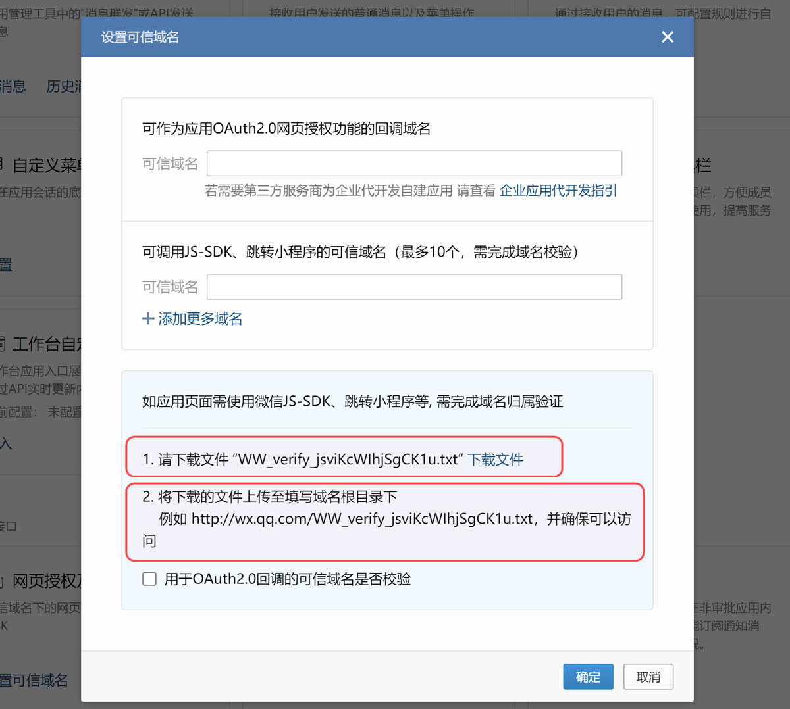
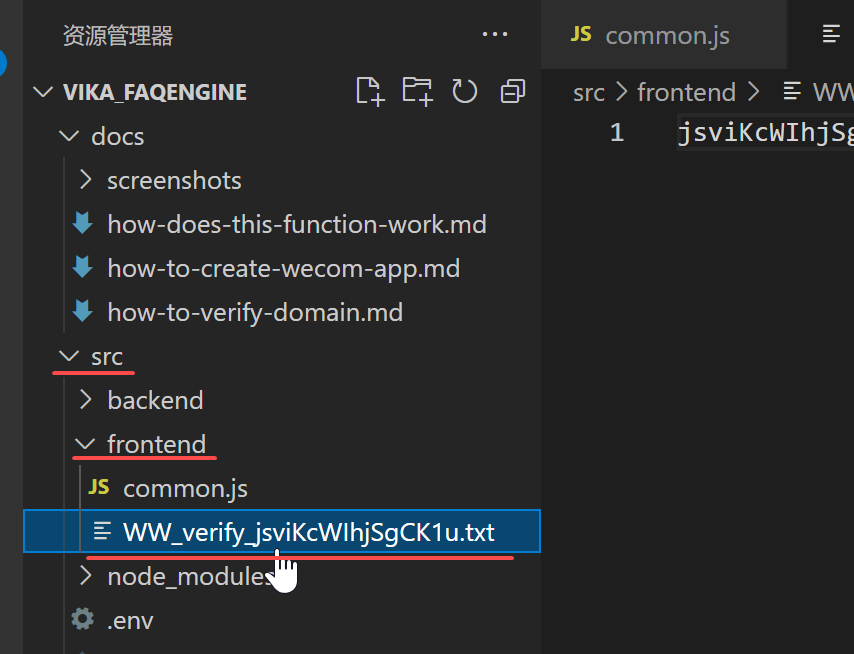

# 如何设置可信域名

## Step 1: 下载校验文件

将校验文件“WW_verify_jsviKcWIhjSgCK1u.txt”下载到本地，并放到 ```工程文件夹/src/frontend/``` 里面





<br/>

## Step 2: 重新将工程代码部署到云函数

此步骤主要用于将校验文件一并上传到云函数，以便企业微信服务端可以访问校验。

```bash
sls deploy
```

## Step 3: 进行校验

当完成部署后，将获得的四级域名填写到可信域名，然后点击右下角的“确定”按钮。这时如果界面提示“成功”，表示已通过可信域名校验；如果提示错误，则需要排查问题。


